---
## Front matter
lang: ru-RU
title: Отчёт по лабораторной работе 5
author: 'Агеева Анастасия Борисовна'
date: 12 ноября, 2021

## Formatting
toc: false
slide_level: 2
theme: metropolis
mainfont: PT Serif
romanfont: PT Serif
sansfont: PT Sans
monofont: PT Mono
header-includes: 
 - \metroset{progressbar=frametitle,sectionpage=progressbar,numbering=fraction}
 - '\makeatletter'
 - '\beamer@ignorenonframefalse'
 - '\makeatother'
aspectratio: 43
section-titles: true
---

## Цель работы

Изучение механизмов изменения идентификаторов, применения SetUID- и Sticky-битов. Получение практических навыков работы в кон- соли с дополнительными атрибутами. Рассмотрение работы механизма смены идентификатора процессов пользователей, а также влияние бита Sticky на запись и удаление файлов.

## Задание

Лабораторная работа подразумевает создание программы и использование Sticky-бита.

# Выполнение лабораторной работы

1. Войдем в систему от имени пользователя guest. (рис.1).

---

2. Создаем программу simpleid.c (рис.1).

  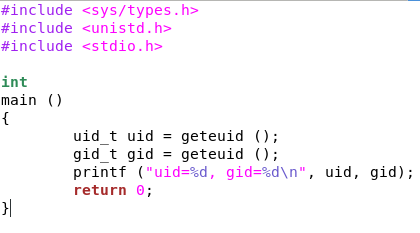{ #fig:001 width=60% }

---

3. Скомплилируем программу и убедимся, что файл программы создан (рис.3-6).

4. Выполним программу simpleid (рис.7).

---

5. Выполним системную программу id и сравним полученный нами результат с данными предыдущего пункта
задания (рис.8).

   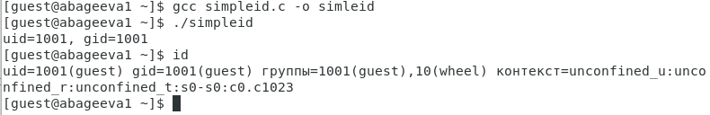{ #fig:002 width=60% }

---

6. Усложним программу, добавив вывод действительных идентификаторов. Получившуюся программу назовем simpleid2.c (рис.9).

   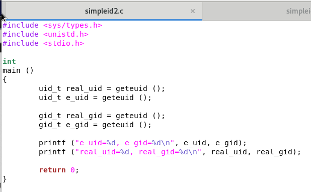{ #fig:003 width=60% }

---

7. Скомпилируем и запустим simpleid2.c (рис.10-11).

8. От имени суперпользователя выполним команды: chown root:guest /home/guest/simpleid2 и chmod u+s /home/guest/simpleid2 (рис.12).

9. Повысим временно свои права с помощью su. (рис.10-11).

10. Выполним проверку правильности установки новых атрибутов и смены владельца файла simpleid2 (рис.10-11).

---

11. Запустим simpleid2 и id и сравним результат (рис.10-11).

   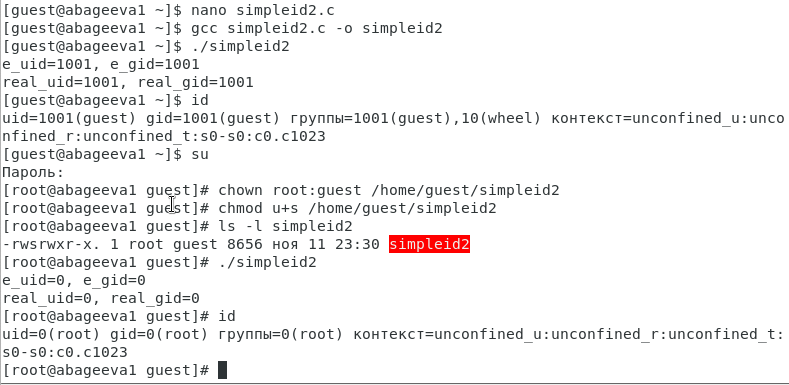{ #fig:004 width=60% }

---

12. Проделаем тоже самое относительно SetGID-бита (рис.10-11).

   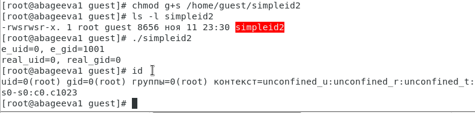{ #fig:005 width=60% }

---

13. Создаем программу readfile.c (рис.10-11).

  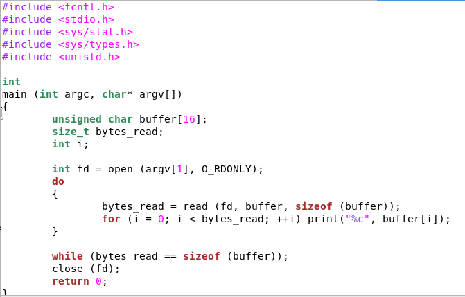{ #fig:006 width=60% }

---

14. Откомпилируем её (рис.10-11).

15. Сменим владельца у файла readfile.c (или любого другого текстового файла в системе) и изменим права так, чтобы только суперпользователь (root) мог прочитать его, a guest не мог (рис.10-11).

  
16. Проверим, что пользователь guest не может прочитать файл readfile.c (рис.10-11).

---

17. Сменим у программы readfile владельца и установим SetU’D-бит (рис.10-11).

   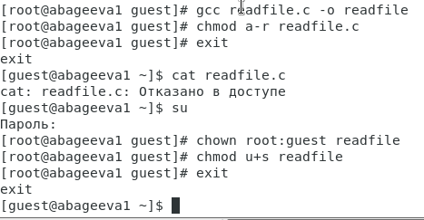{ #fig:007 width=60% }

---

18. Проверим, может ли программа readfile прочитать файл readfile.c (рис.10-11).

   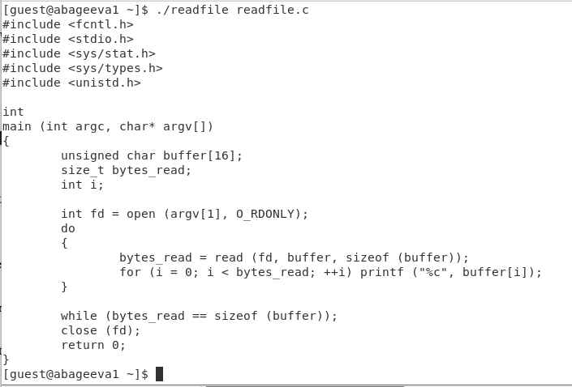{ #fig:008 width=60% }

---

19. Проверим, может ли программа readfile прочитать файл /etc/shadow (рис.10-11).

   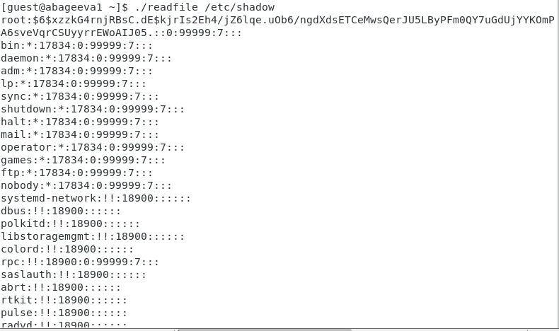{ #fig:009 width=60% }

---

20. Выясним, установлен ли атрибут Sticky на директории /tmp (рис.10-11).

  
21. От имени пользователя guest создадим файл file01.txt в директории /tmp со словом test (рис.10-11).

---

22. Просмотрим атрибуты у только что созданного файла и разрешим чтение и запись для категории пользователей «все остальные» (рис.10-11).

   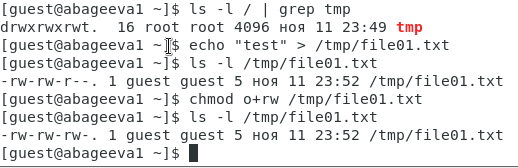{ #fig:010 width=60% }

---

23. От пользователя guest2 (не являющегося владельцем) попробуем прочитать файл /tmp/file01.txt (рис.10-11).

24. От пользователя guest2 попробуем дозаписать в файл /tmp/file01.txt слово test2 (рис.10-11).

25. Проверим содержимое файла (рис.10-11).

26. От пользователя guest2 попробуем записать в файл /tmp/file01.txt слово test3, стерев при этом всю имеющуюся в файле информацию (рис.10-11).

27. Проверим содержимое файла командой (рис.10-11).

28. От пользователя guest2 попробуем удалить файл /tmp/file01.txt (рис.10-11).

29. Повысим свои права до суперпользователя командой su - и выполним после этого команду, снимающую атрибут t (Sticky-бит) с директории /tmp (рис.10-11).

30. Покиним режим суперпользователя (рис.10-11).

31. От пользователя guest2 проверим, что атрибута t у директории /tmp нет (рис.10-11).

32. Повторим предыдущие шаги (рис.10-11).

---

33. Удалось ли вам удалить файл от имени пользователя, не являющегося
его владельцем? нет (рис.10-11).

   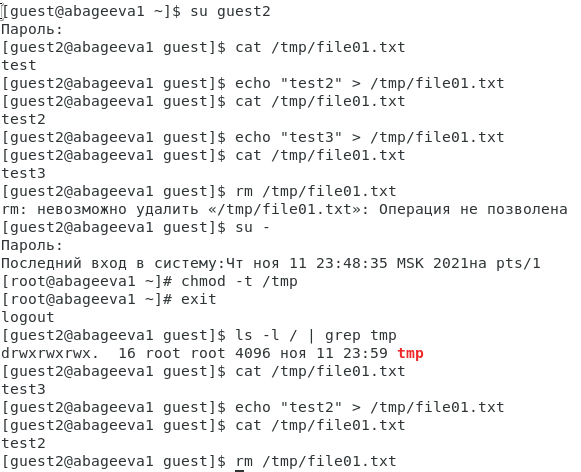{ #fig:011 width=60% }

---

34. Повысим свои права до суперпользователя и вернем атрибут t на директорию /tmp (рис.10-11).

   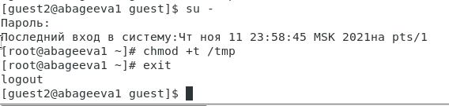{ #fig:012 width=60% }

# Выводы

Я изучила механизмы изменения идентификаторов, применения SetUID- и Sticky-битов. Получила практические навыки работы в консоли с дополнительными атрибутами. Рассмотрела работы механизма смены идентификатора процессов пользователей, а также влияние бита Sticky на запись и удаление файлов.

## {.standout}

Спасибо за внимание
